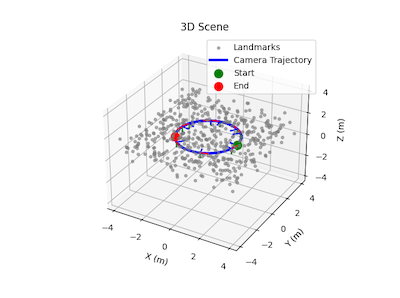

# Visual Odometry, Visual Inertial Odometry and SLAM playground

This repository presents some notes and material on the topic of visual odometry, visual inertial odometry and SLAM.
It is a simple playground to experiment and implement visual inertial odometry and SLAM algorithms:
- simple simulation environment
- boilerplate to run algorithm on popular datasets (EuroC, etc)
- implementation of some popular methodologies

**EuroC dataset:**

**Simulator - Visual features:**

## Current status:

**Implementation:**
- [X] Feature tracking simulator
- [X] Simple feature tracking module based on ORB features and KLT tracking
- [X] Simple visual odometry with epipolar geometry
- [X] Non-Linear bundle adjustment with Jacobian sparsity
- [ ] MSCKF
- [ ] On-Manifold Preintegration for Real-Time Visual-Inertial Odometry

**Topics**
- [X] Epipolar geometry
- [ ] Lie Group for robotics and estimation

## Literature review

Here are the most notable methodologies:
- **MSCKF**: Mourikis & Roumeliotis - "A Multi-State Constraint Kalman Filter for Vision-aided Inertial Navigation" (ICRA 2007)
- **ROVIO**: Bloesch et al. - "Robust visual inertial odometry using a direct EKF-based approach" (IROS 2015)
- **OKVIS**: Leutenegger et al. - "Keyframe-based visual-inertial odometry using nonlinear optimization" (IJRR 2015)
- **VINS-Mono**: Qin et al. - "VINS-Mono: A Robust and Versatile Monocular Visual-Inertial State Estimator" (TRO 2018)
- **On-Manifold Preintegration for Real-Time Visual-Inertial Odometry**: Forster et al - "On-Manifold Preintegration Theory for Fast and Accurate Visual-Inertial Navigation" (CoRR 2015)

## Comparative Summary

| **Method** | **Type** | **Optimization / Filter** | **State Variables** | **Visual Model** | **IMU Handling** | **Key Features / Notes** |
|-------------|-----------|---------------------------|---------------------|------------------|------------------|---------------------------|
| **MSCKF** | VIO | EKF-based Filter | IMU + recent camera poses | Feature-based (tracked features) | Propagation with IMU equations | Efficient but delayed feature inclusion |
| **On-Manifold Preintegration** | VIO | Non-linear Optimization | Keyframe pose, velocity, orientation | Structureless model | IMU preintegration on manifold | Clean formulation, widely used |
| **VIO SLAM with Map Reuse** | SLAM | Non-linear Optimization + Bundle Adjustment | Pose, velocity, biases | Reprojection of tracked features | IMU integrated and optimized | Real-time tracking + background BA |
| **ROVIO** | VIO | EKF-based Filter | Full IMU + limited visual landmarks | Patch-intensity based | Continuous IMU propagation | Robust to lighting, tightly coupled |

## References

### Core VIO/SLAM Papers
- **MSCKF**: [Mourikis & Roumeliotis - "A Multi-State Constraint Kalman Filter for Vision-aided Inertial Navigation" (ICRA 2007)](https://intra.ece.ucr.edu/~mourikis/papers/MourikisRoumeliotis-ICRA07.pdf)
- **ROVIO**: [Bloesch et al. - "Robust visual inertial odometry using a direct EKF-based approach" (IROS 2015)](https://ieeexplore.ieee.org/document/7353768)
- **OKVIS**: [Leutenegger et al. - "Keyframe-based visual-inertial odometry using nonlinear optimization" (IJRR 2015)](https://www.doc.ic.ac.uk/~sleutene/publications/ijrr2014_revision_1.pdf)
- **VINS-Mono**: [Qin et al. - "VINS-Mono: A Robust and Versatile Monocular Visual-Inertial State Estimator" (TRO 2018)](https://arxiv.org/pdf/1708.03852)

### Theoretical Foundations
- **Graph-based SLAM**: Grisetti et al. - "A Tutorial on Graph-based SLAM" (ITSM 2010)
- **Factor Graphs**: Dellaert - "Factor Graphs and GTSAM: A Hands-on Introduction" (Tech Report 2012)
- **On-Manifold Preintegration**: [Forster et al. - "On-Manifold Preintegration for Real-Time Visual-Inertial Odometry" (TRO 2017)](https://arxiv.org/pdf/1512.02363.pdf)

### Survey & Review Papers
- **VI Navigation Review**: Huang - "Visual-inertial navigation: a concise review" (ICRA 2019)
- **VI Sensor Fusion**: Kelly & Sukhatme - "Visual-inertial sensor fusion: Localization, mapping and sensor-to-sensor self-calibration" (IJRR 2011)
- **SLAM Developments**: Dissanayake et al. - "A review of recent developments in Simultaneous Localization and Mapping" (ICIIS 2011)

### Advanced Topics
- **Consistency Analysis**: Kottas et al. - "On the consistency of vision-aided inertial navigation" (ISER 2012)
- **Multi-sensor Calibration**: Furgale et al. - "Unified temporal and spatial calibration for multi-sensor systems" (IROS 2013)
- **Lie Group Dynamics**: Park et al. - "A lie group formulation of robot dynamics" (IJRR 1995)

### Dense Reconstruction
- **REMODE**: Pizzoli et al. - "REMODE: Probabilistic, Monocular Dense Reconstruction in Real Time" (ICRA 2014)

## Books & References

- **[State Estimation for Robotics](http://asrl.utias.utoronto.ca/~tdb/bib/barfoot_ser17.pdf)** - Timothy D. Barfoot
- **[Introduction to Visual SLAM - From Theory to Practice](https://github.com/gaoxiang12/slambook-en)** - Xiang Gao and Tao Zhang 
- **[Geometric Control of Mechanical Systems](https://link.springer.com/book/10.1007/978-1-4899-7276-7)** - Bullo & Lewis (2004)
- **Simultaneous Localization and Mapping: Exactly Sparse Information Filters** - Wang, Huang, Dissanayake (2011)

## Datasets

- **[EuRoC MAV Dataset](https://projects.asl.ethz.ch/datasets/doku.php?id=kmavvisualinertialdatasets)** - Micro Aerial Vehicle datasets with stereo cameras + IMU
- **[TUM VI Dataset](https://vision.in.tum.de/data/datasets/visual-inertial-dataset)** - Visual-Inertial datasets for benchmarking
- **[KAIST Urban Dataset](http://irap.kaist.ac.kr/dataset/)** - Large-scale urban visual-inertial datasets
- **[UZH-FPV Drone Racing](https://fpv.ifi.uzh.ch/)** - High-speed drone racing datasets

## Implementations:
- **[VINS-Mono](https://github.com/HKUST-Aerial-Robotics/VINS-Mono)** - Robust monocular visual-inertial state estimator
- **[ORBSLAM3](https://github.com/UZ-SLAMLab/ORB_SLAM3)** - Feature-based SLAM supporting monocular, stereo, RGB-D
- **[Basalt](https://gitlab.com/VladyslavUsenko/basalt)** - Visual-Inertial Mapping with Rolling Shutter Cameras
- **[ROVIO](https://github.com/ethz-asl/rovio)** - Robust Visual Inertial Odometry framework
- **[MSCKF_VIO](https://github.com/KumarRobotics/msckf_vio)** - Multi-State Constraint Kalman Filter for VIO
- **[msckf_mono](https://github.com/daniilidis-group/msckf_mono)** - Monocular MSCKF implementation
- **[OKVIS](https://github.com/ethz-asl/okvis)** - Open Keyframe-based Visual-Inertial SLAM
- **[Kimera](https://github.com/MIT-SPARK/Kimera)** - Multi-robot SLAM system with VIO
